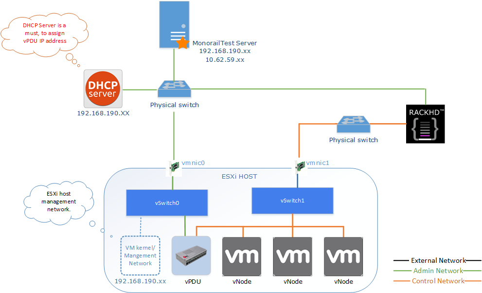

MonorailTest script
===================

[RackHD](https://github.com/RackHD) is an open source project that provides hardware orchestration and management through APIs. [InfraSIM](https://github.com/InfraSIM) is an open source project and it simulates the interfaces/behaviors of hardware devices to simply build a virtual environment. The virtual products built by InfraSIM can be managed by RackHD, since RackHD provide REST APIs. 

Monorailtest script is a tool to integrated many common functionalities of RackHD. It's very convenient to check compute nodes' information, manage the compute nodes, etc. In the **Supported Commands** part, you can get all the functionalities that monorailtest supported.

> **Note:**
> - RackHD Document can be got from [RackHD Document](http://rackhd.readthedocs.org/en/latest/).
> - InfraSIM Document can be got from [InfraSIM Document](http://infrasim.readthedocs.org/en/latest/).


----------
Prerequisites
-------------

- Setup your environment as below picture shows. 
- Monorailtest server must be Linux environment with python environment installed.
- RackHD server is a must. You can find RackHD Setup guide in [RackHD Document](http://rackhd.readthedocs.org/en/latest/).
- vPDU is not a must.
- The server that host the monorailtest script must has connection with RackHD server. 
- RackHD server should have control to the vNodes.

    


How to Run the Script
-------------
You should have a linux working environment, and have python installed.
Then copy the utility to your workspace, and decompress the utility, and
then run:
-  Update the information in conf/hosts.conf according to your real environment. 

```
[RackHDServer]
host = "RackHD Server IP"

[esxihost0]
host = "esxi host IP"
user = "esxi host account"
password = "esxi host password"
```

-  Start the script 

```
python mtc.py
```


Supported Commands
----------
You can input help to get all the supported commands at one time. 

> **Note:**
> - Some commands are using node id as an index. You can either input the full node id, or you can input the last 4 characters, both of them works.

#### list command
- **list**:  List all nodes, as in below picture show.
- **list failed**:  List all nodes without BMC info

#### delete command
- **delete**: Delete all nodes discovered by RackHD server.
- **delete < node id >**: Delete specific node per node id. 

#### lookup command
- **lookups**: Show all DHCP info for nodes including DHCP ID, mac address and IP address. 
- **lookups id < node id >**:  Lookup dhcp info per node id. 
- **lookups mac < mac >**:  Lookup dhcp info per mac address. 

#### catalogs command
- **catalogs**: Show all nodes catalogs data
- **catalogs < node id >**: Show specific node catalogs data per node id
- **catalogs < node id > < source >**: Show node catalogs data per node id and source 2.

#### workflow command
- **workflow list**: Show all available workflows. 
- **workflow get < node id >**:  Get workflow for specific node per node id.
- **workflow set < node id > < action >**: Set workflow for specific node per node id. 
- **workflow active < node id >**: Get active workflow for specific node per node id. 
- **workflow delete < node id >**: Delete workflow for specific node per node id. 

#### getobm command
- **getobm < node id >**: Get OBM settings for specific node per node id. See Figure 10 for example

#### setobm command
- **setobm < node id > < host > < user > < password >**: Set OBM settings for specific node per node id.

    > **Note:**

    > - Basically you don't need to set the OBM manually, once a new node was discovered, the script will extract the BMC info from the catalog data, and then set the OBM automatically.

#### getvm command
- **getvm id < node id >**: Get VM name per node id. 
- **getvm mac < mac >**: Get VM name per mac address.

#### vmpower command
- **vmpower < action > < VM name >**:  Control the VM. 
	- action : reset / reboot / on / off / getstate

#### versions command
- **versions**: List all component versions of RackHD.

#### conf command
- **conf list**: List current configuration. 

- **conf update < section > < option > < value >**: Update specific option for section. 

- **conf add < section > < host > < user > < password >**: Add a section. 

- **conf del < section >**: Delete a section. 

- **conf load**: Load configuration.
	> **Note:**
	
	> - Once you change the configuration, you should run 'conf load' to
	take the configuration effect.

#### lsdhcp command
- **lsdhcp all**: List all IPs allocated by the DHCP server on RackHD Server
- **lsdhcp active**: List current active IPs allocated by the DHCP server on RackHD Server

#### shell command
You could run shell command with this application. E.g. Running 'ls -l ' shell command like this:
- **!ls -l**

#### onconfig command
- **onconfig get**: Get RackHD server configurations. 

#### quit command
- **quit**: Quit the application.

#### help command
- **help**: List all available commands. 
- **help < command >**: Help command. e.g help getvm. 

Logging
-------------

When run this utility, the data including node information, DHCP information will be saved in folder data/*.txt. and the runtime log were logged in the monorailtest.log
